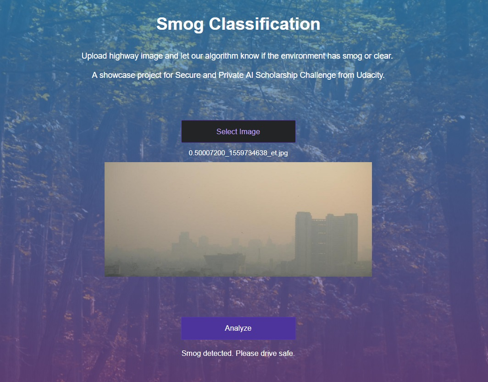
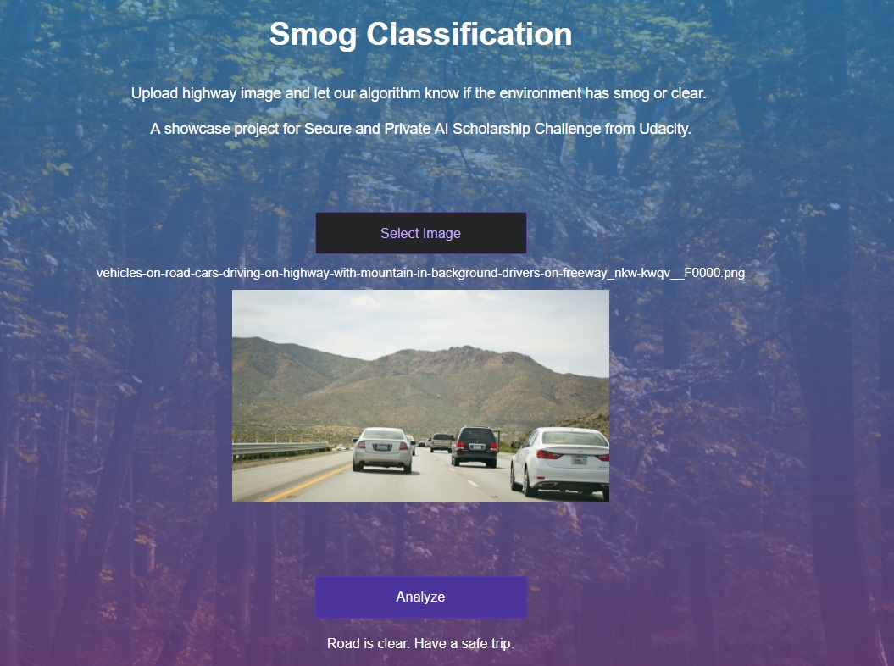
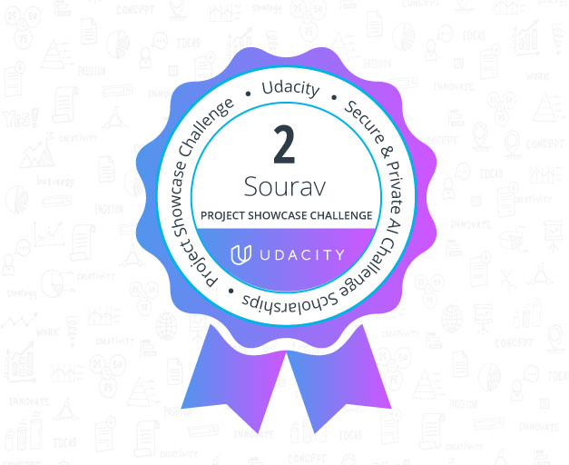

# SmogDetection
REPO FOR TEAM PROJECT SHOWCASE AT SPAIC 2019: SMOG DETECTION PROJECT AT #sg_planetearth Udacity Secure and Private AI

# [Click here for group repo which contains source code with detailed documentation](https://github.com/aksht94/UdacityOpenSource/tree/master/SmogDetection)

## You can find my own analysis above in the notebook
# Problem statement :     
The sudden appearance of smog and/or fog on the highway more often than not causes serious and sometimes fatal accidents. Smog is the main agent for severe air pollution. It can aggravate health problems including problems with breathing and sleeping, as well as it can inversely damage plants and forest cover.     

# Project objective and solution: 
* Smog is a byproduct of the global climate change scenario. As we move further into the industrialized age, Smog continues to pollute our air, reduce visibility on roads and is a leading cause of accidents on roads. The primary goal of the project is to avoid and help reduce rate of accidents in self driving vehicles by using this classifier model as one of the key components attached on traffic cams, so that the vehicle can automatically be alerted about smog on the roads/streets (highways) be it in heavy, medium or low traffic in order to adjust it's dynamics like speed, steering rotation, lanes etc. 
We can use the prediction output labels from the model to alert the vehicle / driver.

# This is the descriptive summary of Model Architechture we have implemented, and the Data Augmentations we have applied.

## Input to model : 
> Images captured by traffic cam.
## Output from model : 
> Prediction as label '0'(clear view) or '1'(smog detected).

## Data Augmentations and Transformations

* [transforms.RandomRotation(30),](https://pytorch.org/docs/stable/_modules/torchvision/transforms/transforms.html#RandomRotation)
  [transforms.RandomHorizontalFlip(),](https://pytorch.org/docs/stable/_modules/torchvision/transforms/transforms.html#RandomHorizontalFlip)
  [transforms.Resize(256),](https://pytorch.org/docs/stable/_modules/torchvision/transforms/transforms.html#Resize)
  [transforms.ColorJitter(0.1),](https://pytorch.org/docs/stable/_modules/torchvision/transforms/transforms.html#ColorJitter)
  [transforms.CenterCrop(224),](https://pytorch.org/docs/stable/_modules/torchvision/transforms/transforms.html#CenterCrop)
  [transforms.ToTensor(),](https://pytorch.org/docs/stable/_modules/torchvision/transforms/transforms.html#ToTensor)
  [transforms.Normalize([0.485, 0.456, 0.406],
                      [0.229, 0.224, 0.225])](https://pytorch.org/docs/stable/_modules/torchvision/transforms/transforms.html#Normalize)
        
## Model name 
* [planetEarch_improved.pt](https://www.kaggleusercontent.com/kf/18699045/eyJhbGciOiJkaXIiLCJlbmMiOiJBMTI4Q0JDLUhTMjU2In0..NX3MZVkixkhASIBsP-e0uA.SplTd0njipbzC_x4mF-HsOJiU8ca2ycipZNQ_dxpuzJfhezWWHeE7BGL0JnQ1Ni8xh3YmdWUNubsC-pYVTr20wMeCYV-2Paqe4OvtPCNzpXuAHX23oQF-d5YK6x7ruPPm-7vBTCHvKGQzDW9ZuMXPg.FT_NpgWhdVu3GQnSQzaCJQ/planetEarch_improved.pt)

## Description of model 
So, there are five modules which contain deeper sublayers.
Let's go through them one by one:

* CNN layers : 7 
* Linear layers : 2
* Pooling layers : 4
* Batch normalization layers : 7

> conv1 :
* CNN layers : Conv2d(3, 32, 3, padding=1), Conv2d(32, 32, 3, stride=2, padding=1)
* Pooling layer : MaxPool2d(2, 2)
* Batch normalization layer : BatchNorm2d(32), nn.BatchNorm2d(32),

> conv2 : 
* CNN layers : Conv2d(32, 64, 3, padding=1), Conv2d(64, 64, 3, stride=2, padding=1)
* Pooling layer : MaxPool2d(2, 2)
* Batch normalization layer : BatchNorm2d(32), nn.BatchNorm2d(64),

> conv3 :
* CNN layers : Conv2d(64, 128, 3, padding=1), Conv2d(128, 128, 3, stride=2, padding=1)
* Pooling layer : MaxPool2d(2, 2)
* Batch normalization layer : BatchNorm2d(128), BatchNorm2d(128)

> conv4 :
* CNN layers : Conv2d(128, 256, 3, padding=1)
* Pooling layer : MaxPool2d(2, 2)
* Batch normalization layer : BatchNorm2d(256)

> fc :
* Linear layers : Linear(256, 128), Linear(128, 2)

## Dropout has been applied in conv4 and linear layer where probability = 0.35 in conv4 and 0.5 in fc.

## Activation functions : 
[mila](https://github.com/digantamisra98/Mish/blob/master/Mish/Torch/mish.py) activation has been used.
Activation Mila (@Diganta's new activation)
https://github.com/digantamisra98/Mila

## Optimizer : 
[Adam](https://pytorch.org/docs/stable/_modules/torch/optim/adam.html) optimizer is used here.

## Loss function : 
[CrossEntropyLoss](https://pytorch.org/docs/stable/_modules/torch/nn/modules/loss.html) is used.

## Learning rate (with lr scheduler) :
* lr schedular = StepLR(optimizer, step_size=10, gamma=0.5)
* lr = 0.001

## Epochs : 
epoch : 50

# Results 

## Test loss :
Test Loss:36.734721 

## Test Accuracy :
Accuracy: 99.0000

## Class wise loss :
* Test Accuracy of     0: 98% (389/393)
* Test Accuracy of     1: 98% (378/382)

## Overall testing accuracy : 
Test Accuracy (Overall): 98% (767/775)      

## Model working :    
    
      

### Contributors:     

No | Name | Slack Handle 
--- | --- | ---
1 | Shudipto Trafder | @Shudipto Trafder
2 | Berenice Terwey | @Berenice
3 | Agata Gruza | @Agata [OR, USA]
4 | Ingus Terbets | @Ingus Terbets
5 | Akash Antony | @Akash Antony
6 | Alexander Villasoto | @Alexander Villasoto
7 | Pooja Vinod | @Pooja Vinod
8 | Ramkrishna Acharya | @Viper
9 | Sourav Kumar | @sourav kumar
10 | George Christopoulos | @George Christopoulos
11 | Sayed Maheen Basheer | @Sayed Maheen Basheer
12 | Abhishek Lalwani | @Abhishek Lalwani
13 | Laura Truncellito | @LauraT     

> Note: Above folders are just for showcasing type of data used but it's ofcourse not the complete dataset.
For complete dataset, you can mail me.    
## Highlights :    
* We came 2nd in Udacity's Project Showcase Challenge     

